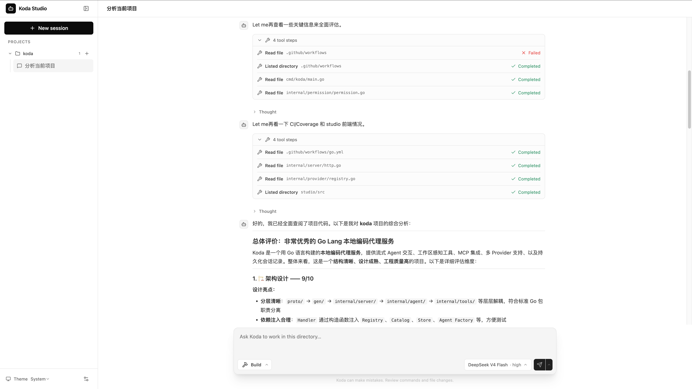

# koda

`koda` 是一个本地 coding agent 服务，使用 Go、Protocol Buffers、Connect RPC 和
[`github.com/soasurs/adk`](https://github.com/soasurs/adk) 构建。它为客户端提供
流式 agent turn、workspace 与 MCP 工具、操作审批、结构化提问、Provider 配置和
持久化对话历史等运行时能力。

[English](README.md)

Koda 内置了本地 Web 界面，其源码位于 [`studio/`](studio/) 目录。



## 启动 Koda Studio

环境要求：

- Go 1.26，或 `go.mod` 声明的版本；
- 至少配置一个 Provider 的 API key。

启动内嵌 UI，并使用默认浏览器打开：

```bash
go run ./cmd/koda studio
```

Studio 与 Connect API 共用同一个仅限 loopback 的 HTTP origin。Koda 会先尝试
`localhost:8080`，端口被占用时回退到可用的 loopback 端口，并输出实际 URL。也可以
显式指定端口：

```bash
go run ./cmd/koda studio --addr 127.0.0.1:8787
```

## 启动无界面服务

启动 Connect API server：

```bash
go run ./cmd/koda serve
```

Koda 会先尝试 `localhost:8080`。若端口已被占用，它会选择另一个 loopback 端口并
输出实际地址。也可以显式指定端口：

```bash
go run ./cmd/koda serve --addr 127.0.0.1:8787
```

服务只接受 loopback 地址，并且不会打开浏览器。Koda 还会从
`~/.koda/koda.yaml` 读取进程级配置；命令行参数优先于配置文件。配置文件可选，可配置
服务地址、诊断日志和进程级 MCP server：

```yaml
version: 1
server:
  address: 127.0.0.1:8080
log:
  level: info
mcp:
  servers:
    - id: exa
      name: Exa
      transport: http
      url: https://mcp.exa.ai/mcp
      read_only: true
      headers:
        x-api-key: ${EXA_API_KEY}
    - id: local-search
      name: Local search
      transport: stdio
      command: npx
      args: [-y, example-mcp-server]
      env:
        SEARCH_TOKEN: ${SEARCH_TOKEN}
```

`--addr` 会覆盖 `server.address`。两者都未设置时，Koda 会尝试默认地址；如果
默认端口已被占用，则回退到可用的 loopback 端口。日志级别支持 `debug`、`info`、
`warn` 和 `error`，默认为 `info`。所有级别的日志都是诊断信息并写入 stderr，监听
地址仍写入 stdout。DEBUG 日志包含操作耗时、工具名称等安全的 ADK 运行时元数据，
但不会记录 prompt、工具参数、命令输出、文件内容或凭据。

Koda 在启动时连接一次 MCP server，并将发现的工具提供给所有 Build agent；显式配置
`read_only: true` 的 server 会自动执行，也会提供给 Plan agent；其它 MCP 工具只在
Build 模式中提供，并且每次调用都需要审批。HTTP 配置使用 MCP Streamable HTTP；
远程 endpoint 必须使用 HTTPS，loopback server
可以使用明文 HTTP。stdio 配置会直接启动 `command` 而不经过 shell，并可设置 `args`、
`env` 和 `workdir`。Header、参数和环境变量值支持标准 `$NAME` 或 `${NAME}` 展开；
引用的变量不存在时启动失败。配置的 server 无法连接，或返回无效、冲突的工具 catalog
时，Koda 同样会启动失败，而不是静默丢失能力。模型看到的工具名采用
`mcp__<server-id>__<tool-name>`，工具结果进入模型上下文前会受到大小限制。修改 MCP
配置后需要重启 Koda。客户端可通过 `ListMCPServers` 和 `GetMCPServer` 查看启动时的
连接与工具快照；Studio 的 Settings > MCP 展示相同信息。API 不会返回 HTTP header
或 stdio 环境变量值。

只有在 server 暴露的全部工具都无副作用时才能设置 `read_only: true`。stdio 配置是以
Koda 用户权限启动的受信任本地进程；工具调用审批不会对 server 进程本身进行沙箱隔离。

## Provider 与本地数据

Koda 内置以下 Provider：

| ID | API | 环境变量 |
|---|---|---|
| `anthropic` | Anthropic Messages | `ANTHROPIC_API_KEY` |
| `openai` | OpenAI Chat Completions | `OPENAI_API_KEY` |
| `openai-responses` | OpenAI Responses | `OPENAI_API_KEY` |
| `gemini` | Gemini GenerateContent | `GEMINI_API_KEY` |
| `deepseek` | DeepSeek | `DEEPSEEK_API_KEY` |

环境变量中的凭据优先于已保存的凭据，并且不会被复制到 Koda 配置文件中。客户端可以
通过 `koda.v1.KodaService` 管理自定义 endpoint 和模型 override。

Koda 将状态保存在 `~/.koda`：

```text
~/.koda/koda.yaml       可选的进程级配置
~/.koda/providers.json   Provider 定义与凭据
~/.koda/koda.db          Session 与 ADK 对话历史
~/.koda/skills/          Koda 启动时加载的 Agent Skills
```

Provider 配置保持独立，因为 Koda 会通过 API 更新它们，而 `koda.yaml` 是仅在启动时
读取的用户配置，其中包括进程级 MCP server。Provider/Model 选择、reasoning
effort、workspace 和权限仍作为 Session 配置保存在数据库中。Provider 文件仅允许
当前用户访问。模型列表只读取本地
状态；只有客户端显式调用 `RefreshModels` 时才会访问网络。Provider 连接发生变化后，
之前发现的模型 snapshot 会失效。

`~/.koda/skills` 的每个直接子目录可以存放一个 Agent Skill，其中 `SKILL.md` 的
name 必须与目录名一致。Koda 在进程启动时只加载一次 catalog；agent 通过
`load_skill` 加载匹配的完整指令，并通过 `read_skill_resource` 读取其中列出的 UTF-8
资源。新增、删除或修改 skill 后需要重启 Koda。skills 目录不存在时按空 catalog
处理。无效 skill 会记录错误日志并被跳过，不会阻止启动；如果 skills 目录本身无法
加载，Koda 也会记录错误并使用空 catalog 继续启动。客户端可以通过 `ListSkills` 和
`GetSkill` 查看这个固定的启动快照；Studio 的 Settings > Skills 中也会展示列表和完整
定义。

## 目录浏览

本地客户端可以在创建 Session 前调用 `ListDirectories` 选择工作目录。空路径从当前
用户的 home 目录开始；每次响应只包含当前目录的 canonical path、parent path，以及
直接子目录的名称和路径。该 RPC 不列出文件、不读取文件内容，也不修改文件系统，
并继续受服务现有的 loopback Host 和 Origin 检查保护。

## Agent Run

`Run` 通过 server stream 执行一个多模态用户 turn。输入可以按顺序包含文本、HTTPS
图片 URL，或带 MIME type 的内联图片 bytes。流中有四种 frame：

- `Event`：模型增量或完整对话事件；
- `ToolApproval`：等待用户批准的操作；
- `QuestionPrompt`：agent 发起的结构化提问；
- `RunCompleted`：turn 成功提交后的完成信号，其中包含最新的持久化 `Session` 快照。

每个 Session 独立选择 Provider、Model、reasoning effort、workspace 和权限策略。同一
Session 的 Run 会串行执行；如果已经提交的 turn 无法通过 `RunCompleted` 被确认，历史
会回滚。

当 Session 标题仍为空时，第一次 Run 会并行使用当前选择的模型，根据首条用户输入
生成简短标题。标题持久化后通过 `RunCompleted.session` 返回；标题生成失败不会导致
agent turn 失败。Run 执行期间，客户端可以先显示首条输入的本地截断文本作为临时标题。

## 工具与权限

Plan agent 可以读取文件、列目录、搜索内容、查找文件、提问，并可通过 `run_shell`
执行一条白名单内的只读 Git 命令。其他命令和会修改仓库的 Git 操作都会被拒绝。

Build agent 额外提供整文件创建和写入、Hashline 编辑，以及支持任意命令语法的
`run_shell`。Build 模式的 Shell 执行仍受 Session 的 Shell 审批策略控制。

文件访问按 Session 配置：

| 级别 | Workspace 内读取 | Workspace 内写入 | Workspace 外访问 |
|---|---:|---:|---:|
| `WORKSPACE_READ` | 允许 | 审批 | 审批 |
| `WORKSPACE_WRITE` | 允许 | 允许 | 审批 |
| `UNRESTRICTED` | 允许 | 允许 | 允许 |

工具会先解析符号链接，再判断路径是否位于 workspace 内。Shell 权限独立配置，因为
不受限的进程实际上可以访问整个文件系统。

`read_file` 和 `search_text` 会返回内容 revision 与 `LINE:HASH` 锚点；`edit_file`
在原子应用修改前再次校验它们。可预测的文件写入会在审批帧和结果帧中携带结构化 diff。

## 开发

API 的源文件是 [`proto/koda/v1/service.proto`](proto/koda/v1/service.proto)。`gen/`
和 `studio/src/gen/` 下的生成文件需要提交，但不能手工修改。

`internal/studio/dist` 下的 Studio 资源由构建生成，并被 Git 忽略。
修改 Studio 后或首次 checkout 后，需要使用 Node.js 24 和 pnpm 10 从 monorepo
源码构建前端：

```bash
./build/studio.sh
```

然后执行 Go 检查：

```bash
gofmt -w .
go build ./...
go vet ./...
go test ./...
go test -cover ./...
go test -race ./...
git diff --check
```

修改 Protocol Buffer 契约后，先运行 `buf format -w`、`buf lint`、`buf build` 和
`buf generate`，再执行上述 Go 检查。

## 发布

推送 `v*` tag 会触发 release workflow。它会从该 tag 的 monorepo 源码构建
Studio，在原生 macOS runner 上测试并打包 amd64 与 arm64 binary，生成 SHA-256
checksums，然后将完整的 draft 发布为 GitHub Release。

贡献者需要遵循的仓库规则见 [AGENTS.md](AGENTS.md)。

## Agent 指令

Koda 会分层组装 coding agent 的 system instruction。稳定的内嵌公共 Prompt
和 Build 或 Plan 模式 Prompt 位于最前；每次 Run 再追加规范化工作目录、当前
Session 的有效权限，以及从文件系统根目录到 workspace 的分层 `AGENTS.md`。
同一次 Run 的所有工具调用轮次复用同一份 workspace 指令快照，下一次 Run
会重新读取。

运行时上下文和 workspace 指令只作用于当前请求。它们会在每次模型调用时
发送，但不会加入 conversation event，也不会持久化到 Session history。

## License

Apache License 2.0，详见 [LICENSE](LICENSE)。
