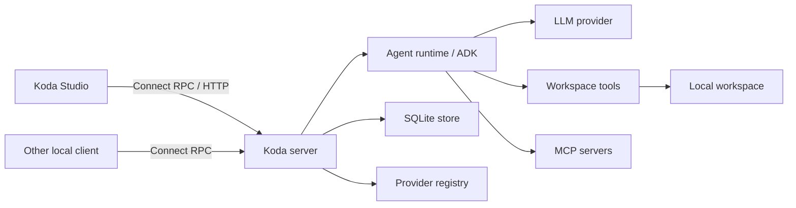

# Architecture

[中文](architecture_zh-CN.md)

This section describes Koda's implemented architecture, the invariants that
keep agent turns durable and safe, and the intended extension points. It is for
contributors working on the runtime rather than an API field reference or an
operator guide.

For process settings and local data locations, see
[Configuration](configuration.md). The public API source of truth remains
[`proto/koda/v1/service.proto`](../proto/koda/v1/service.proto).

## System overview

Koda is a local, single-process coding-agent service. A Connect RPC boundary
owns durable sessions and mediates access to an ADK-backed agent runtime,
providers, workspace tools, MCP servers, and SQLite history. The embedded
Studio is one client of the same API and does not own durable conversation
state.

The design follows several rules:

- Session is the configuration, history ownership, and serialization boundary.
- ADK session history is the source of truth for conversation content.
- generated Protobuf types stay at the server boundary;
- immutable agent structure may be cached, while Run-specific state is passed
  through context;
- partial output and frontend interactions are transient;
- complete events and terminal Turn status remain durable after failure or
  interruption;
- a successful Run is journaled as complete only after history and session
  metadata are consistent;
- file and process capabilities default to the least permissive valid policy;
- process capabilities loaded at startup are distinct from session and Run
  configuration.

## Topics

- [System structure](architecture/system-structure.md) covers process startup,
  package ownership, dependency direction, and lifecycle scopes.
- [Run lifecycle](architecture/run-lifecycle.md) follows a turn from request
  validation through streaming, interactions, durable finalization, and
  terminal publication.
- [Agents and tools](architecture/agents-and-tools.md) covers runner caching,
  layered instructions, modes, path classification, approvals, and questions.
- [Storage and context compaction](architecture/storage-and-compaction.md)
  explains SQLite ownership, per-session locking, history mutation, undo, and
  durable compaction generations.
- [Providers and integrations](architecture/providers-and-integrations.md)
  covers provider revisions, local model discovery, Agent Skills, MCP, and the
  Studio boundary.
- [Security and evolution](architecture/security-and-evolution.md) collects
  trust boundaries, logging constraints, test seams, and rules for extending
  the system.

## Vocabulary

| Term | Meaning |
|---|---|
| Session | Durable runtime configuration and history ownership boundary. |
| Run | One server-owned execution with one or more client subscriptions. |
| Turn | A durable history unit created during Run execution; it may complete, fail, or be interrupted. |
| Event | An ADK history record; complete events are durable and partial events are transient. |
| Frame | One `RunResponse` payload observed by a client. |
| Compaction generation | An immutable summary and working-state snapshot for an archived history prefix. |
| Connection revision | A provider connection identity used to reject stale discovery and cached agents. |

## Reading the design

Statements in these documents describe current behavior unless explicitly
marked as a possible evolution. Architectural invariants are constraints that
new implementations must preserve; possible evolutions are not implemented
features or commitments.
