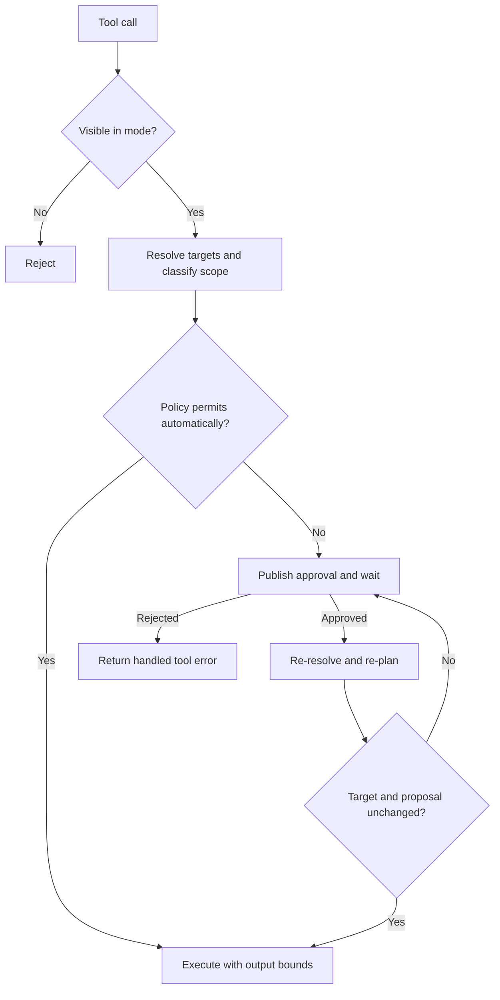

# Agents and tools

[中文](agents-and-tools_zh-CN.md) · [Architecture index](../architecture.md)

Koda caches the immutable structure of an ADK runner while injecting the
environment and interactions of each Run through context. Tool availability is
selected by agent mode; approval is selected separately by session policy and
resolved filesystem scope.

## Runner construction and caching

The agent factory validates the persisted session, resolves the provider and
model from local state, resolves the effective reasoning effort, loads the
workspace instruction hierarchy, and constructs the mode-specific tools and
prompt.

The cache key covers:

- session ID;
- resolved provider ID and connection revision;
- model and effective reasoning effort;
- Build or Plan mode;
- workdir;
- file and shell access;
- a fingerprint of stable, workspace, and skill instructions.

These fields affect model behavior, visible capabilities, or provider
connection identity. Changing them must not reuse an incompatible runner.
Superseded entries for a session or provider revision are evicted. Compactors
are short-lived because their prompts and lifecycle differ from interactive
runners.

Approval brokers, question brokers, the current Run environment, and the
current compaction snapshot are intentionally absent from the cache key and
cached objects. They are context-scoped so one cached runner cannot retain
another Run's stream or interaction state.

## Instruction layers

Instructions are composed in stable-to-dynamic order:

1. the embedded common prompt;
2. the embedded Build or Plan prompt;
3. a normalized Run environment containing workdir and effective permissions;
4. hierarchical `AGENTS.md` files from the filesystem root to the workspace;
5. the process-level skill catalog instruction.

The workspace hierarchy is captured when the runner configuration is resolved.
A closer `AGENTS.md` appears later and can refine parent guidance. Its
fingerprint participates in the cache key, so a later Run rebuilds the runner
after instructions change.

Runtime and workspace instructions are sent to the model on every iteration of
the Run but are not appended to conversation events. The compaction snapshot is
likewise synthetic request history, not an ordinary stored event. This keeps
durable conversation history limited to user, assistant, and tool interaction.

## Agent modes

Plan mode exposes read-oriented workspace tools, web fetch, structured
questions, Agent Skills, explicitly read-only MCP tools, and one restricted
`run_shell` surface for an allowlisted read-only Git command. It rejects other
commands, environment overrides, external helpers, unsafe options, and mutating
Git operations regardless of the session's Shell setting.

Build mode adds file creation, whole-file writing, Hashline editing, general
shell command syntax, and all MCP tools. Visibility does not imply automatic
execution: file, shell, and mutating MCP calls still follow their approval
policies.

## Permission model

File access and shell access are separate because a general process has effects
that cannot be bounded by filesystem-tool path analysis.

| File access | Workspace read | Workspace write | Outside workspace |
|---|---:|---:|---:|
| `WORKSPACE_READ` | automatic | approval | approval |
| `WORKSPACE_WRITE` | automatic | automatic | approval |
| `UNRESTRICTED` | automatic | automatic | automatic |

Every general shell command requires approval unless Shell access is
`UNRESTRICTED`. Unrestricted Shell has effective access to the full filesystem
and process environment even when File access is narrower.

Tool operations are classified by capability kind (`file_read`, `file_write`,
`shell`, or `mcp`) and scope (`workspace`, `outside_workspace`, or `global`).
The permission package contains the pure decision; tools are responsible for
producing an accurate kind, scope, target list, summary, and optional diff.

## Path resolution

The session workdir is normalized to an absolute, symlink-resolved directory.
Relative tool paths resolve against it. Existing targets are resolved through
symlinks before scope classification, preventing an in-workspace symlink from
granting automatic access to an external target.

For a path that does not exist yet, Koda finds and resolves the closest
existing ancestor, then appends the remaining path. This closes the equivalent
bypass for writes through a symlinked parent. Multi-path operations use the
widest resulting scope.

Approval is a plan, not permanent authorization. After a blocking approval,
the tool re-resolves paths and recomputes the proposed content revision. If the
target or proposal changed while waiting, it requests approval again.

## Safe file mutation

`read_file` and `search_text` expose a content revision and `LINE:HASH`
anchors. Hashline edits identify content rather than trusting a stale line
number. Immediately before an atomic write, `edit_file` validates the revision
and anchors against the current file.

Predictable mutations construct structured file changes before approval. The
same change representation is returned after execution. It is display-oriented
and bounded; it is not a substitute for the final filesystem check.

## Shell execution

Build shell commands accept general syntax and use a timeout. On timeout, Koda
cancels the full process group so descendants do not survive the tool call.
Command output is bounded before it enters model context.

Plan shell is a separate parser and policy, not Build shell followed by a
best-effort read-only check. It accepts one allowlisted Git command and rejects
syntax or options that could introduce mutation, arbitrary execution, or an
unclassified repository/worktree access.

## Approvals and questions

An approval contains the original provider tool-call ID, model-visible tool
name, exact JSON arguments, capability kind, scope, exact targets, a safe
summary, and any predictable structured file changes. Koda adds a separate
interaction ID for the resolution RPC.

The `ask_questions` tool uses the same Run-context pattern but carries validated
questions, mutually exclusive option metadata, and optional free-form input.
Both interaction types block only the calling tool and remain safe when other
same-round tools are executing concurrently.
