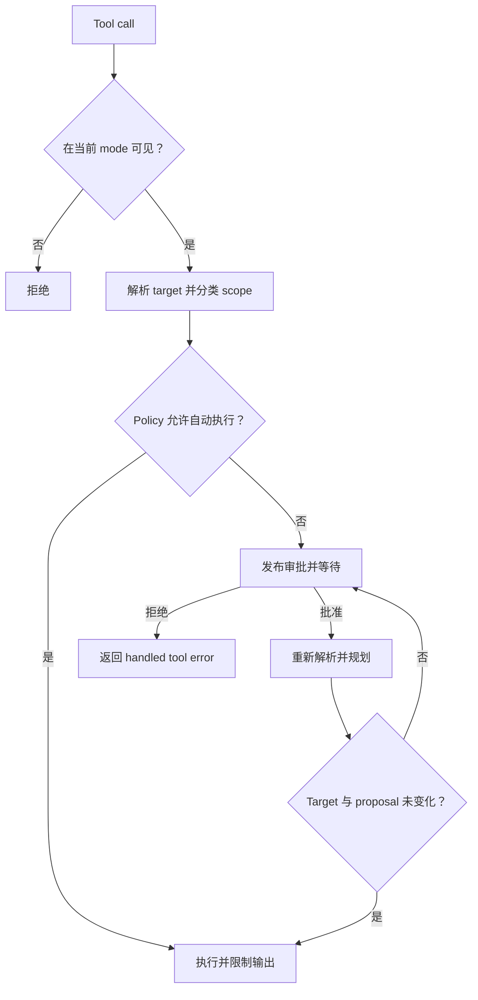

# Agent 与工具

[English](agents-and-tools.md) · [架构导航](../architecture_zh-CN.md)

Koda 缓存 ADK Runner 的不可变结构，通过 context 注入每次 Run 的 environment 和交互。
Agent mode 决定工具是否可见；Session policy 和解析后的文件系统 scope 分别决定是否需要
审批。

## Runner 构造与缓存

Agent factory 会校验持久化 Session，从本地状态解析 Provider 和 Model，解析有效的
reasoning effort，加载 workspace 指令层级，并构造对应 mode 的工具和 Prompt。

Cache key 包含：

- Session ID；
- 解析后的 Provider ID 和 connection revision；
- Model 和有效 reasoning effort；
- Build 或 Plan mode；
- workdir；
- file 和 shell access；
- stable、workspace 和 skill instruction 的 fingerprint。

这些字段都会影响模型行为、可见能力或 Provider 连接身份；修改后不能复用不兼容的
Runner。同一 Session 或 Provider revision 的过期 entry 会被清除。Compactor 是短生命
周期对象，因为它的 Prompt 和生命周期与交互式 Runner 不同。

Approval broker、question broker、当前 Run environment 和 compaction snapshot 不进入
cache key，也不会被缓存对象捕获。它们都属于 context，防止缓存 Runner 保留另一次 Run
的 stream 或交互状态。

## 指令层级

指令从稳定到动态依次组合：

1. 内嵌 common Prompt；
2. 内嵌 Build 或 Plan Prompt；
3. 包含 workdir 和有效权限的规范化 Run environment；
4. 从文件系统根目录到 workspace 的分层 `AGENTS.md`；
5. 进程级 skill catalog instruction。

解析 Runner 配置时会捕获 workspace 层级。距离 workspace 更近的 `AGENTS.md` 出现在
后面，可以细化上级指令。其 fingerprint 进入 cache key，所以指令变化后的下一次 Run
会重建 Runner。

Runtime 和 workspace 指令会在 Run 的每次模型调用中发送，但不会追加到 conversation
event。Compaction snapshot 同样是合成的请求历史，而不是普通的持久化 event。因此持久
对话历史只包含用户、助手和工具交互。

## Agent Mode

Plan mode 提供只读 workspace 工具、web fetch、结构化提问、Agent Skills、显式声明为
read-only 的 MCP 工具，以及一个只能执行白名单只读 Git 命令的受限 `run_shell`。无论
Session Shell 设置如何，它都会拒绝其它命令、环境覆盖、外部 helper、不安全选项和会
修改 Git 的操作。

Build mode 额外提供文件创建、整文件写入、Hashline 编辑、通用 Shell 命令语法和全部
MCP 工具。可见并不代表自动执行：文件、Shell 和有副作用的 MCP 调用仍遵循各自审批
策略。

## 权限模型

文件访问和 Shell 访问分别建模，因为通用进程的影响无法由文件系统工具的路径分析界定。

| File access | Workspace 读取 | Workspace 写入 | Workspace 外访问 |
|---|---:|---:|---:|
| `WORKSPACE_READ` | 自动 | 审批 | 审批 |
| `WORKSPACE_WRITE` | 自动 | 自动 | 审批 |
| `UNRESTRICTED` | 自动 | 自动 | 自动 |

除非 Shell access 是 `UNRESTRICTED`，每条通用 Shell 命令都需要审批。即使 File access
较窄，不受限 Shell 仍能有效访问整个文件系统和进程环境。

工具操作按 capability kind（`file_read`、`file_write`、`shell` 或 `mcp`）和 scope
（`workspace`、`outside_workspace` 或 `global`）分类。Permission 包只包含纯判断；工具
负责生成准确的 kind、scope、target list、summary 和可选 diff。

## 路径解析

Session workdir 会规范化为绝对、已解析符号链接的目录。相对工具路径以它为基准。Scope
分类前会解析已有 target 的符号链接，防止 workspace 内链接为外部 target 绕过审批。

对于尚不存在的路径，Koda 会找到并解析最近的已存在 ancestor，再附加剩余路径。这也
关闭了通过 symlink parent 写入的同类绕过方式。多路径操作使用其中最宽的 scope。

Approval 是一次执行计划，而不是永久授权。阻塞审批返回后，工具会重新解析路径并计算
拟议的内容 revision。如果等待期间 target 或 proposal 发生变化，会再次请求审批。

## 安全文件修改

`read_file` 和 `search_text` 会返回 content revision 与 `LINE:HASH` anchor。Hashline
edit 通过内容定位，而不是信任可能过期的行号。执行原子写入前，`edit_file` 会立即根据
当前文件重新校验 revision 和 anchor。

可预测的文件修改会在审批前构造结构化 file change，并在执行后返回同一表示。该结构
用于展示且受到大小限制，不能替代最终文件系统检查。

## Shell 执行

Build Shell 接受平台原生语法：Unix 使用 `sh`，Windows 使用 Windows PowerShell。
命令会设置 timeout；超时后 Koda 会终止整个 process tree，避免子进程在工具调用结束后
继续运行。命令输出进入模型 context 前会受到大小限制。

Plan Shell 是独立 parser 和 policy，不是 Build Shell 加一层尽力而为的只读检查。它只
接受一条白名单 Git 命令，并拒绝可能引入修改、任意执行或无法分类 repository/worktree
访问的语法与选项。

## 审批与提问

Approval 包含原始 Provider tool-call ID、模型可见工具名、完整 JSON 参数、capability
kind、scope、精确 target、安全 summary 和可预测的结构化 file change。Koda 会另加一个
interaction ID 供 resolution RPC 使用。

`ask_questions` 工具使用相同 Run-context 模式，但承载已校验的问题、互斥选项 metadata
和可选 free-form 输入。两类交互都只阻塞调用它的工具，并能安全处理同一轮次中并发执行
的其它工具。
