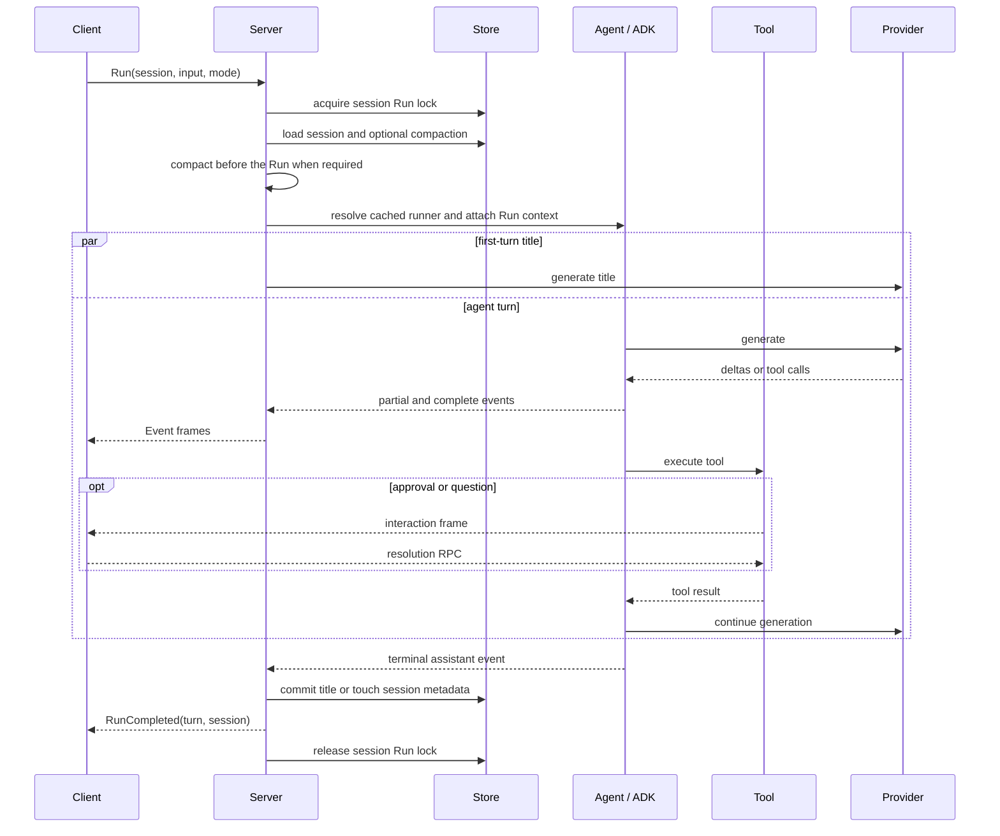

# Run lifecycle

[中文](run-lifecycle_zh-CN.md) · [Architecture index](../architecture.md)

`Run` is the central consistency protocol in Koda. It is more than a stream of
model tokens: it owns session serialization, optional compaction, all model and
tool rounds, durable history, session metadata, and final client
acknowledgment.

## Request and serialization

The server first validates the session ID, mode, and ordered multimodal input.
Text, HTTPS image URLs, and inline image data are converted from Proto at this
boundary. Complete user events retain their original parts so history and undo
can round-trip the request.

The handler then acquires the session Run lock with the request context. The
same lock is shared with ADK history operations and is reentrant through the
locked context. It remains held until the completion frame has been accepted or
the turn has been rolled back. Runs for different sessions may proceed
concurrently; operations for one session are serialized.

## Execution sequence

Before constructing the runner, the server may compact the preceding active
history. `CompactionProgress` makes that extra model work visible but is never
persisted. A valid current snapshot is attached to the Run context and injected
before active history by an agent hook.

The agent factory selects a runner from the persisted session settings and the
requested Build or Plan mode. Run-specific environment, approvals, questions,
and compaction state are attached through context after cache lookup.

For a session with no title and no prior events, title generation starts in
parallel with the first turn. Its failure is logged but does not fail the Run.

## Streaming and interactions

ADK can execute independent tool calls from one model round concurrently. A
per-Run publisher therefore guards every `stream.Send`, including ordinary
events, approval requests, questions, compaction progress, and completion.
Failure to send any frame cancels the Run context.

Partial events are presentation state. Complete user, assistant, and tool
events are the durable ADK history. The server streams both, but only counts
complete event and token usage when recording diagnostics.

A tool that needs consent calls a context-scoped authorizer. The server:

1. creates a Koda interaction ID while preserving the provider tool-call ID;
2. registers a pending request in the process broker;
3. publishes `ToolApproval` on the active Run stream;
4. blocks that tool call until `ResolveToolApproval`, rejection, or
   cancellation.

Structured questions use the same pattern with `QuestionPrompt` and
`SubmitQuestionAnswers`. A rejected approval becomes a handled tool error that
the model can respond to. Cancellation or loss of the Run is terminal.

## Completion protocol

A Run is successful only after ADK yields a complete assistant event with a
terminal finish reason: stop, length, or content filter. A tool-call finish
reason is not terminal because the turn must continue through the tool result
and another model call.

The handler requires a turn ID, waits for optional title generation, and
commits session metadata. It then publishes `RunCompleted` with both the turn
ID and the latest durable Session snapshot. The Run lock is still held while
this frame is sent.

This ordering gives the completion frame a strong meaning:

> Every complete event in the turn and the returned session metadata are
> durable and mutually consistent when the client observes `RunCompleted`.

The client may display partial events or a temporary title optimistically, but
must use `RunCompleted` as the commit boundary.

## Failure and rollback

ADK may have committed complete events before a later provider call, stream
send, or metadata update fails. Failed, canceled, abandoned, or unacknowledged
turns must not remain in active history.

When a turn ID exists and terminal completion cannot be acknowledged, the
server uses a cancellation-independent cleanup context to remove the turn and
restore the pre-Run session snapshot. Cleanup occurs before releasing the Run
lock, so another operation cannot observe a partially rolled-back session.

| Failure | Result |
|---|---|
| cancellation while waiting for the lock | no session change |
| compaction failure below the reserve boundary | record failure and continue |
| compaction failure at the hard boundary | return `RESOURCE_EXHAUSTED` |
| provider or runtime failure | return a mapped Connect error; incomplete turn is not active |
| approval rejection | handled tool result; the Run may continue |
| stream send failure | cancel the Run and roll back committed turn data |
| missing terminal event or turn ID | internal error and rollback when possible |
| title generation failure | log and complete with the previous title |
| metadata commit or `RunCompleted` failure | restore history and session metadata |

## History mutation outside Run

Session update, deletion, undo, and compaction use the same session
serialization boundary. Undo accepts the expected server-reported undoable turn
so a stale client cannot remove newer history or cross a compaction boundary.
Deleting a session removes active metadata and ADK history as one logical
operation.
