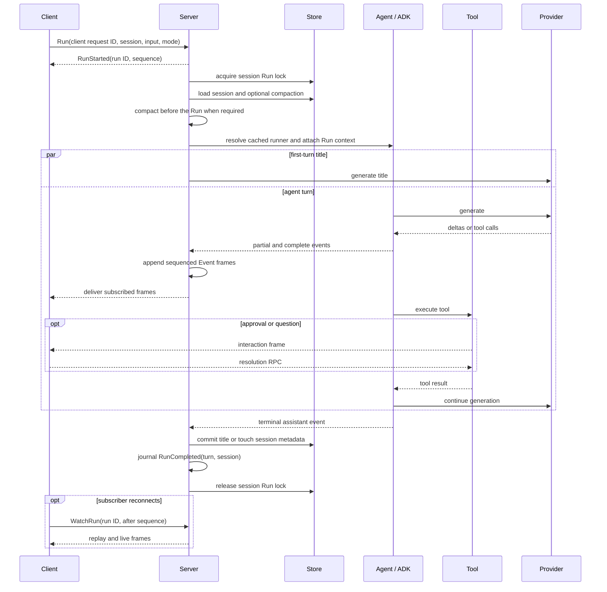

# Run lifecycle

[中文](run-lifecycle_zh-CN.md) · [Architecture index](../architecture.md)

`Run` is the central consistency protocol in Koda. It is a server-owned
execution, not the lifetime of one transport stream. It owns session
serialization, optional compaction, all model and tool rounds, durable history,
session metadata, and a replayable terminal outcome.

## Request and serialization

The server first validates the session ID, mode, and ordered multimodal input.
Text, HTTPS image URLs, and inline image data are converted from Proto at this
boundary. Complete user events retain their original parts so history and undo
can round-trip the request.

Admission uses `client_request_id` to make retries idempotent and journals a
server-assigned Run ID before execution begins. The process-owned execution
goroutine acquires the session Run lock with its own context. The same lock is
shared with ADK history operations and is reentrant through the locked context.
It remains held until durable finalization and terminal journal publication
finish. Runs for different sessions may proceed concurrently; a second
distinct Run for one session is rejected while the first is active.

## Execution sequence

Before constructing the runner, the server may compact the preceding active
history. `CompactionProgress` makes that extra model work visible but is never
persisted. A valid current snapshot is attached to the Run context and injected
before active history by an agent hook.

The agent factory selects a runner from the persisted session settings and the
requested Build or Plan mode. Run-specific environment, approvals, questions,
and compaction state are attached through context after cache lookup.

For a session with no title and no prior events, title generation starts in
parallel with the first turn. Its failure is logged but does not fail the Run.

## Streaming and interactions

ADK can execute independent tool calls from one model round concurrently. A
per-Run in-memory journal assigns one total sequence to ordinary events,
approval requests, questions, compaction progress, and terminal frames.
Subscriptions read from that journal; a slow or disconnected subscriber does
not block or cancel execution. `WatchRun` resumes after an exclusive sequence
cursor, and `CancelRun` explicitly requests execution cancellation.

Partial events are presentation state. Complete user, assistant, and tool
events are the durable ADK history. The server streams both, but only counts
complete event and token usage when recording diagnostics.

A tool that needs consent calls a context-scoped authorizer. The server:

1. creates a Koda interaction ID while preserving the provider tool-call ID;
2. registers a pending request in the process broker;
3. journals `ToolApproval` and exposes it in the active Run snapshot;
4. blocks that tool call until `ResolveToolApproval`, rejection, or
   cancellation.

Structured questions use the same pattern with `QuestionPrompt` and
`SubmitQuestionAnswers`. Pending interactions survive subscriber disconnects
and are returned by `GetActiveRun`. A rejected approval becomes a handled tool
error that the model can respond to. Explicit cancellation or process shutdown
is terminal.

## Completion protocol

A Run is successful only after ADK yields a complete assistant event with a
terminal finish reason: stop, length, or content filter. A tool-call finish
reason is not terminal because the turn must continue through the tool result
and another model call.

The handler requires a turn ID, waits for optional title generation, and
commits session metadata. It then publishes `RunCompleted` with both the turn
ID and the latest durable Session snapshot. The Run lock is still held while
this frame is journaled; delivery to any particular subscriber is independent.

This ordering gives the completion frame a strong meaning:

> Every complete event in the turn and the returned session metadata are
> durable and mutually consistent in a journaled `RunCompleted` frame.

The client may display partial events or a temporary title optimistically, but
must use `RunCompleted` as the commit boundary.

## Failure and durable Turn status

ADK may have committed complete events before a later provider call or metadata
update fails. Complete events remain durable. ADK finalizes
the Turn as `failed` or `interrupted`, and its projector supplies only a safe
prefix plus an ephemeral status notice to later model context. History reads
lazily mark running Turns left by an earlier process as `interrupted/abandoned`.

| Failure | Result |
|---|---|
| cancellation while waiting for the lock | no session change |
| compaction failure below the reserve boundary | record failure and continue |
| compaction failure at the hard boundary | return `RESOURCE_EXHAUSTED` |
| provider or runtime failure | journal `RunTerminated` and retain a failed Turn |
| approval rejection | handled tool result; the Run may continue |
| subscriber send failure | detach that subscriber; execution continues |
| explicit `CancelRun` | cancel execution and retain an interrupted Turn |
| missing terminal event | the agent wrapper fails and finalizes the Turn as failed |
| title generation failure | log and complete with the previous title |
| metadata commit or completion journal failure | journal a failed terminal outcome without rewriting completed Turn facts |

Run journals and pending interactions are process-local. A network reconnect or
Studio page reload can reattach while the Koda process remains alive; a Koda
process restart cannot resume execution and existing durable recovery marks
leftover running Turns abandoned.

## History mutation outside Run

Session update, deletion, undo, and compaction use the same session
serialization boundary. Undo accepts the expected server-reported undoable turn
so a stale client cannot remove newer history or cross a compaction boundary.
Deleting a session removes active metadata and ADK history as one logical
operation.
