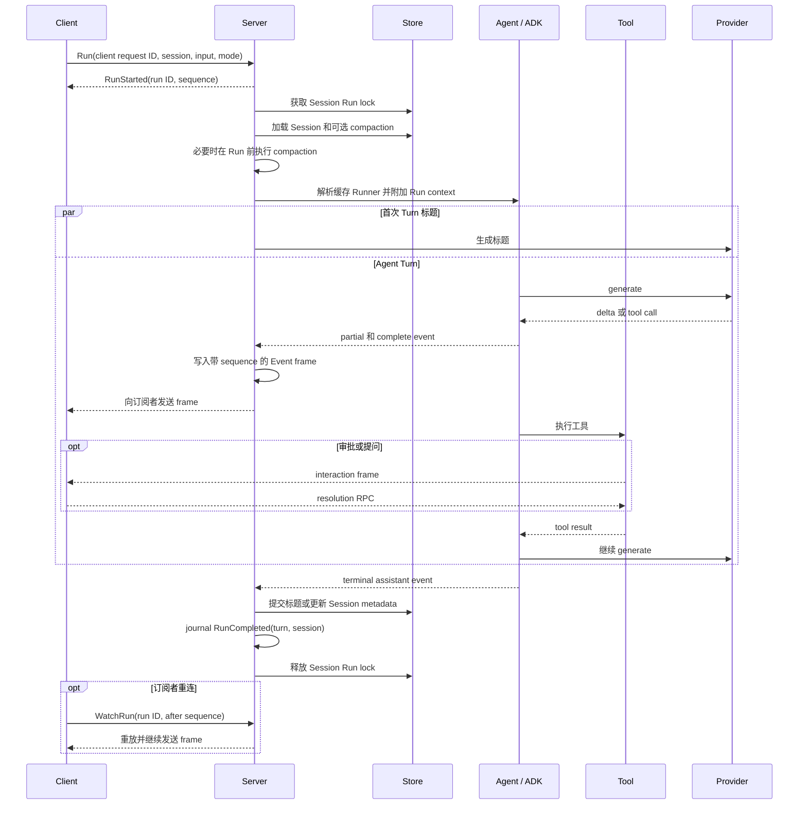

# Run 生命周期

[English](run-lifecycle.md) · [架构导航](../architecture_zh-CN.md)

`Run` 是 Koda 的核心一致性协议。它是 Server-owned execution，而不是单个 transport
stream 的生命周期。它拥有 Session 串行化、可选 compaction、所有模型与工具轮次、
持久化历史、Session metadata 和可重放终态。

## 请求与串行化

Server 首先校验 Session ID、mode 和有序多模态输入。文本、HTTPS 图片 URL 和内联图片
数据都在这一边界从 Proto 转换。Complete user event 会保留原始 parts，确保 history
和 undo 可以完整往返输入。

Admission 使用 `client_request_id` 保证重试幂等，并在执行前将 Server 分配的 Run ID
写入 journal。进程拥有的执行 goroutine 使用自己的 context 获取 Session Run lock。该锁
与 ADK 历史操作共用，并通过 locked context 支持可重入调用。锁一直持有到持久化终结和
terminal journal 发布完成。不同 Session 的 Run 可以并发；一个 Session 存在 active Run
时会拒绝另一个不同 Run。

## 执行顺序

构造 Runner 前，Server 可能压缩之前的 active history。`CompactionProgress` 会让这部分
额外模型工作对客户端可见，但不会持久化。有效的当前 snapshot 会附加到 Run context，
由 Agent hook 注入 active history 之前。

Agent factory 根据持久化 Session 设置和请求的 Build 或 Plan mode 选择 Runner。Run 特有
的 environment、approval、question 和 compaction state 在 cache lookup 后通过 context
附加。

如果 Session 没有标题和既有 event，标题生成会与第一次 turn 并行启动。标题生成失败会
写入日志，但不会使 Run 失败。

## 流式输出与交互

ADK 可以并发执行同一模型轮次中相互独立的 tool call。每个 Run 的进程内 journal 会为
普通 event、approval、question、compaction progress 和 terminal frame 分配统一递增
sequence。订阅从 journal 读取；慢订阅者或断线不会阻塞或取消执行。`WatchRun` 从指定
exclusive sequence cursor 恢复，`CancelRun` 才会显式请求取消执行。

Partial event 是展示状态。Complete user、assistant 和 tool event 才是持久化 ADK history。
Server 会流式发送两者，但诊断统计只计算 complete event 和 token usage。

需要用户同意的工具会调用 context-scoped authorizer。Server 会：

1. 创建 Koda interaction ID，同时保留 Provider tool-call ID；
2. 在进程 broker 注册 pending request；
3. journal `ToolApproval`，并在 active Run snapshot 中暴露；
4. 阻塞该 tool call，等待 `ResolveToolApproval`、拒绝或取消。

结构化问题通过 `QuestionPrompt` 和 `SubmitQuestionAnswers` 使用相同模式。Pending
interaction 会跨订阅断线保留，并由 `GetActiveRun` 返回。拒绝审批会成为模型可见的
handled tool error；显式取消或进程关闭才是终止错误。

## 完成协议

只有 ADK 产生 finish reason 为 stop、length 或 content filter 的 complete assistant event，
Run 才算成功。Tool-call finish reason 不是终止状态，因为 turn 必须继续经过工具结果和
下一次模型调用。

Handler 要求存在 turn ID，等待可选标题生成，并提交 Session metadata。随后发布包含
turn ID 和最新持久化 Session snapshot 的 `RunCompleted`。journal 该 frame 时仍持有
Run lock，是否成功发送给某个订阅者与执行结果无关。

因此 completion frame 具有明确语义：

> journal 中出现 `RunCompleted` 时，turn 的所有 complete event 和返回的 Session
> metadata 都已持久化且相互一致。

客户端可以乐观显示 partial event 或临时标题，但必须以 `RunCompleted` 作为提交边界。

## 失败与持久化 Turn 状态

在后续 Provider 调用或 metadata 更新失败前，ADK 可能已经提交了一些
complete event。这些 event 会继续持久化。ADK 将 Turn 终结为 `failed` 或 `interrupted`，
后续模型上下文通过 projector 只获得安全前缀和瞬态状态说明。读取历史时，会懒恢复旧进程
遗留的 running Turn，将其标记为 `interrupted/abandoned`。

| 失败 | 结果 |
|---|---|
| 等待锁时取消 | Session 无变化 |
| reserve 边界以下 compaction 失败 | 记录失败并继续 |
| hard boundary 上 compaction 失败 | 返回 `RESOURCE_EXHAUSTED` |
| Provider 或 runtime 失败 | journal `RunTerminated`，并保留 failed Turn |
| 审批拒绝 | handled tool result；Run 可以继续 |
| subscriber send 失败 | 只断开该订阅者；执行继续 |
| 显式 `CancelRun` | 取消执行并保留 interrupted Turn |
| 缺少 terminal event | Agent wrapper 返回错误并将 Turn 终结为 failed |
| 标题生成失败 | 记录日志，使用原有标题完成 |
| metadata commit 或 completion journal 失败 | journal failed 终态，但不重写已经 completed 的 Turn 事实 |

Run journal 和 pending interaction 只存在于进程内。只要 Koda 进程仍存活，网络重连或
Studio 页面重载都可以恢复订阅；Koda 进程重启无法恢复执行，现有持久化恢复逻辑会把
遗留 running Turn 标记为 abandoned。

## Run 之外的历史修改

Session update、delete、undo 和 compaction 使用同一 Session 串行化边界。Undo 会携带
Server 返回的 expected undoable turn，避免过期客户端删除更新的历史或越过 compaction
边界。删除 Session 会将 active metadata 和 ADK history 作为一个逻辑操作移除。
