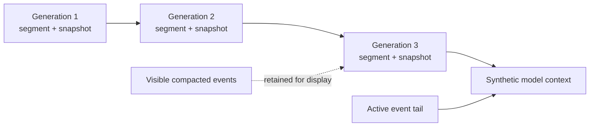

# Storage and context compaction

[中文](storage-and-compaction_zh-CN.md) · [Architecture index](../architecture.md)

SQLite stores both Koda session metadata and ADK conversation history. Koda
owns their lifecycle as one logical session while preserving ADK history as the
source of truth for conversation content.

## Storage ownership

Koda tables store session configuration, timestamps, archive and deletion
state, context accounting, and the current compaction generation. ADK-prefixed
tables store sessions and events. The two schemas share a database and a
per-session Run locker.

A Koda session may exist before its ADK ledger. `EnsureADKSession` lazily
creates the ledger before the first production Run, after confirming the Koda
session still exists.

The database enables foreign keys, WAL journaling, a busy timeout, and normal
synchronous mode. On Unix, the default directory is restricted to `0700` and
database, WAL, and shared-memory files are restricted to `0600` when present.
On Windows, the default directory inherits the current user's profile ACL.
Schema changes are append-only numbered migrations applied transactionally.

## Session serialization

The Run locker is keyed by ADK application and session ID. Its context-aware
acquisition preserves cancellation, and the locked context permits reentrant
calls through the ADK session service.

The same boundary serializes:

- full Runs, including durable Turn finalization and terminal journal
  publication;
- session settings and metadata updates;
- history mutation and undo;
- session deletion;
- context compaction commit and failure accounting.

This is stronger than locking individual SQL statements. It prevents a model
Run from using settings that change halfway through and keeps undo, lazy crash
recovery, and compaction from racing a new turn.

## History views

Complete ADK events are durable. Partial events and interaction frames are not.
Koda distinguishes an event's storage state from its visibility to the model:

- active events are supplied to later model Runs;
- compacted events remain available for full conversation display;
- deleted events are absent from active user history;
- a compaction snapshot is synthetic model context, not an Event.

`ListEvents` returns the complete visible conversation together with the
current compaction boundary and the server-selected undoable turn. Studio uses
that snapshot to show generation boundaries without hiding prior conversation.

## Why compaction is durable

Simply dropping old events would lose working state and make behavior dependent
on a process restart. Replacing visible events with a summary would destroy the
user's original conversation. Koda instead persists an immutable summary of an
archived prefix while retaining the original events for display.

Each generation records:

- its generation number and previous compaction ID;
- the start and boundary event IDs;
- a structured immutable segment summary;
- a structured working-state snapshot;
- source and estimated post-compaction token counts;
- the model ID and creation time.

The Session points to the current generation and tracks usage and failed
attempts. A commit supplies the expected generation. The transaction rejects a
stale generation, validates the active boundary, inserts the new immutable
record, archives exactly the selected prefix, and advances the Session pointer.

## Selection and scheduling

The server considers compaction before a new Run, using the token usage from a
previous completed turn. It resolves the Session's selected model metadata
first, falling back to `context.window_tokens` when no model-specific window is
known. It attempts compaction at the configured percentage of that effective
window or at the lower hard limit needed to reserve output and summary
capacity.

The selector works on complete turns. It retains up to the configured number of
recent turns while respecting the retained-token budget and chooses an older
active prefix. The boundary is persisted by event ID rather than by an array
offset.

When an attempt fails below the hard limit, Koda records the measured usage and
failure count and lets the Run continue. It does not retry at the same measured
usage, avoiding repeated model cost without new information. Higher measured
usage permits another attempt. At or beyond the hard limit, failure stops the
Run with `RESOURCE_EXHAUSTED`.

## Structured compaction pipeline

The compactor asks the session's selected provider and model for two versioned
JSON structures:

- a segment summary describing the newly archived immutable history;
- a working-state snapshot covering objectives, requirements, constraints,
  decisions, facts, progress, files, commands, failures, questions, and next
  steps.

Arbitrary prose is rejected. Draft decoding and schema validation happen before
persistence. One repair call may fix an invalid draft or, when verification is
enabled, an invalid verification result. Provider errors, cancellation,
content filtering, and invalid durable input are not treated as formatting
problems and do not trigger repair.

Normally the previous snapshot is supplied while summarizing the new segment.
To limit recursive drift, every configured interval uses a rebase:

1. load the bounded snapshot checkpoint from one interval earlier;
2. load every immutable segment summary after that checkpoint;
3. combine them with the newly selected events;
4. produce a rebuilt current snapshot.

This bounds rebase input by the interval while retaining an auditable sequence
of segment summaries.

## Model context projection

Compaction selects and commits boundaries from raw durable event IDs, but sends
the selected prefix through the same ADK Turn projector used by Runner. Failed
and interrupted output is therefore summarized with the same safety rules.

Before each model call, an agent hook removes compacted active-history input
and inserts the decoded current snapshot before the remaining active tail. The
snapshot is request-only synthetic history. It does not enter ADK events, so it
cannot appear as a user-authored message or be recursively persisted by normal
turn handling.

Disabling compaction stops creation of new generations. Existing snapshots
remain part of the model context because their archived source events are no
longer active.

## Undo and compaction boundaries

Undo is limited to the server-reported latest visible user turn that can be removed
without invalidating durable compaction state. The request carries the expected
turn ID. If history advanced or the boundary changed, the operation fails
instead of deleting newer history selected by a stale client.
