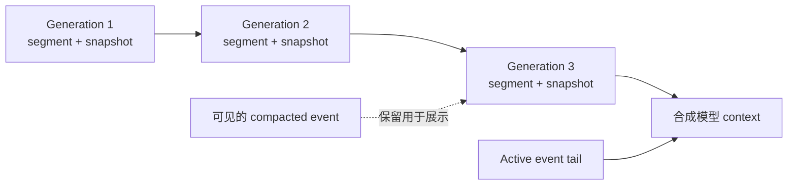

# 存储与 Context Compaction

[English](storage-and-compaction.md) · [架构导航](../architecture_zh-CN.md)

SQLite 同时保存 Koda Session metadata 和 ADK 对话历史。Koda 将它们的生命周期作为一个
逻辑 Session 管理，同时保持 ADK history 是对话内容的事实来源。

## 存储所有权

Koda table 保存 Session 配置、时间戳、archive 和 delete 状态、context 统计以及当前
compaction generation。带 ADK 前缀的 table 保存 Session 和 event。两套 schema 共用一个
数据库和一套 per-session Run locker。

Koda Session 可以先于 ADK ledger 存在。第一次生产 Run 前，`EnsureADKSession` 会在确认
Koda Session 仍存在后按需创建 ledger。

数据库启用 foreign key、WAL journal、busy timeout 和 normal synchronous mode。默认目录
权限为 `0700`；数据库、WAL 和 shared-memory 文件存在时权限为 `0600`。Schema 变更使用
只追加的编号 migration，并在 transaction 中应用。

## Session 串行化

Run locker 以 ADK application 和 Session ID 为 key。获取过程支持 context 取消，locked
context 允许通过 ADK Session service 重入。

以下操作共用同一串行化边界：

- 包含持久化 Turn 终结与 completion 确认的完整 Run；
- Session 设置与 metadata update；
- history mutation 和 undo；
- Session delete；
- context compaction commit 和失败统计。

该边界比锁定单条 SQL 更强。它可以防止模型 Run 中途使用被修改的设置，并避免 undo、
懒 crash 恢复和 compaction 与新 turn 竞争。

## History 视图

Complete ADK event 会持久化，partial event 和 interaction frame 不会。Koda 将 event 的
存储状态与它对模型的可见性分开：

- active event 会提供给后续模型 Run；
- compacted event 仍可用于展示完整对话；
- deleted event 不再属于 active user history；
- compaction snapshot 是合成模型 context，不是 Event。

`ListEvents` 返回完整可见对话、当前 compaction boundary 和 Server 选定的 undoable turn。
Studio 使用该快照展示 generation boundary，同时保留之前的对话。

## 为什么 Compaction 必须持久化

直接删除旧 event 会丢失 working state，并使进程重启前后的行为不同。使用 summary 替换
可见 event 会破坏用户原始对话。因此 Koda 会持久化已归档前缀的不可变 summary，同时
保留原 event 用于展示。

每个 generation 记录：

- generation number 和 previous compaction ID；
- start 与 boundary event ID；
- 结构化不可变 segment summary；
- 结构化 working-state snapshot；
- source token 和预计压缩后 token；
- Model ID 和创建时间。

Session 指向当前 generation，并记录 usage 和失败尝试。Commit 需要提供 expected
generation。Transaction 会拒绝过期 generation、校验 active boundary、插入新的不可变
记录、精确归档选中的前缀，并推进 Session pointer。

## 选择与调度

Server 会在新 Run 前根据上一次已确认 turn 的 token usage 判断是否 compaction。达到配置
trigger，或者到达必须为输出和 summary 预留空间的较低 hard limit 时，会尝试压缩。

Selector 以完整 turn 为单位工作。它在 retained-token budget 范围内最多保留配置数量的
最近 turn，并选择更早的 active 前缀。Boundary 按 event ID 持久化，而不是数组 offset。

如果尝试在 hard limit 以下失败，Koda 会记录测得的 usage 和失败次数，并允许 Run 继续。
相同 usage 下不会重复尝试，从而避免在没有新信息时重复消耗模型；更高 usage 会允许再次
尝试。达到或超过 hard limit 后，失败会以 `RESOURCE_EXHAUSTED` 停止 Run。

## 结构化 Compaction Pipeline

Compactor 使用 Session 选择的 Provider 和 Model 生成两个带版本的 JSON 结构：

- 描述新归档不可变历史的 segment summary；
- 覆盖 objective、requirement、constraint、decision、fact、progress、file、command、
  failure、question 和 next step 的 working-state snapshot。

任意 prose 都会被拒绝。持久化前会执行 draft decoding 和 schema validation。一次 repair
call 可以修复无效 draft；启用 verification 时，也可用于修复无效 verification result。
Provider error、取消、content filter 和无效持久化输入不是格式问题，不会触发 repair。

普通压缩会在总结新 segment 时提供 previous snapshot。为限制递归漂移，每隔配置的代数
执行一次 rebase：

1. 加载一个 interval 之前的有界 snapshot checkpoint；
2. 加载 checkpoint 之后的所有不可变 segment summary；
3. 将它们与新选择的 event 合并；
4. 生成重建后的当前 snapshot。

这样可以把 rebase 输入限制在 interval 内，同时保留可审计的 segment summary 序列。

## 模型 Context 投影

Compaction 使用原始持久化 event ID 选择并提交 boundary，但交给 compactor 的前缀会经过
与 Runner 相同的 ADK Turn projector。因此 failed/interrupted 输出会采用相同的安全规则。

每次模型调用前，Agent hook 会从输入中移除 compacted active-history，并在剩余 active tail
前插入解码后的当前 snapshot。该 snapshot 是 request-only synthetic history，不会进入
ADK event，因此不会表现为用户消息，也不会被普通 turn 处理递归持久化。

关闭 compaction 只会停止创建新 generation。由于已有 snapshot 的 source event 已不再
active，它们仍会继续参与模型 context。

## Undo 与 Compaction Boundary

Undo 只能删除 Server 返回的最新可见 user turn，且不能破坏持久化 compaction state。请求会
携带 expected turn ID。如果 history 已推进或 boundary 已变化，操作会失败，而不是让过期
客户端删除更新后的历史。
