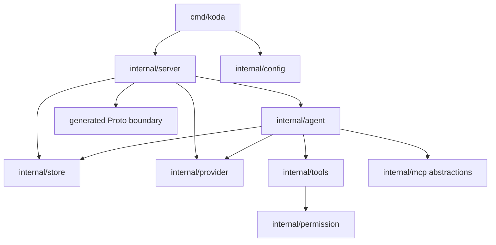

# System structure

[中文](system-structure_zh-CN.md) · [Architecture index](../architecture.md)

Koda separates process wiring, transport concerns, agent construction, tools,
and persistence so that durable state does not depend on UI or provider-specific
representations.

## Process model

`koda serve` starts the Connect API. `koda studio` starts the same API and
mounts embedded Studio assets on the same loopback origin. The service is a
single process: its in-memory catalogs, interaction brokers, agent cache, and
MCP connections are not coordinated with another Koda process.

Startup proceeds in dependency order:

1. load the optional process configuration;
2. initialize diagnostic logging;
3. open the provider registry and local model catalog;
4. load the fixed Agent Skill catalog;
5. connect MCP servers and discover their fixed tool catalog;
6. open SQLite, apply Koda and ADK migrations, and create the ADK session
   service;
7. construct the agent factory and Connect handler;
8. bind a loopback listener and start the HTTP server;
9. optionally open Studio in the default browser.

Startup failure is capability-sensitive. Invalid config, unavailable configured
MCP servers, or an unusable database stop startup because continuing would
silently change expected behavior. Invalid individual skills are logged and
skipped because skills are optional additions. Missing provider credentials do
not prevent startup; they are reported when a session tries to use that
provider.

Shutdown first stops Run admission and cancels active Runs, then closes the HTTP
server, session store, and MCP connections. Stdio MCP children belong to the
process-level MCP manager.

## Lifecycle scopes

| Scope | Owned state |
|---|---|
| Process | config, logging, provider registry, model catalog, skill catalog, MCP connections, Run manager, interaction brokers, HTTP server |
| Session | provider and model selection, reasoning effort, workdir, permissions, history, context usage, compaction state |
| Run | identity, admission state, mode, user input, captured instructions, sequenced frame journal, pending interactions, cancellation, current compaction snapshot |

Process-level catalogs are loaded or connected at startup and remain fixed
unless their documented API supports mutation. Session settings are persisted
and may invalidate cached agents. Run state must never be captured in a cached
runner.

## Package ownership

| Package | Responsibility |
|---|---|
| `cmd/koda` | Dependency assembly, command-line handling, signals, listener selection, and shutdown; no agent or storage policy. |
| `proto/koda/v1`, `gen/koda/v1` | Public contract source and generated transport types, not the domain model. |
| `internal/server` | Connect validation, Proto/domain conversion, frame serialization, Run coordination, and Connect error mapping. |
| `internal/agent` | ADK runner construction and caching, prompts, provider models, title generation, and compaction model calls. |
| `internal/tools` | Coding tools, path resolution, output limits, approval plans, questions, Hashline editing, and shell policy. |
| `internal/permission` | Capability kinds, scopes, access levels, and the pure approval decision. |
| `internal/store` | Session metadata, ADK session service, SQLite migrations, history mutation, locks, and compaction generations. |
| `internal/provider` | Provider definitions, credentials, connection revisions, bundled model metadata, catalogs, and discovery. |
| `internal/mcp` | MCP transports, connections, startup catalogs, namespaced tools, result bounds, and approval exposure. |
| `internal/skills` | Process-level Agent Skill discovery and loading. |
| `internal/studio`, `studio` | Embedded asset serving and the web client; no durable runtime semantics. |

## Dependency boundaries

The server is the composition boundary. Core packages do not import generated
Proto bindings. Domain values are converted only when they enter or leave an
RPC. This prevents API evolution from forcing transport concerns into tools,
storage, providers, or agent construction.

The store supplies ADK's `SessionService` rather than depending on the agent
factory. The agent factory consumes narrow provider, session, skill, MCP, and
tool interfaces. Tools report domain approvals and questions; server adapters
turn them into streamed API interactions.

## Public contract

`proto/koda/v1/service.proto` is authoritative. The Run stream contains only:

- complete or partial `Event` frames;
- blocking `ToolApproval` interactions;
- blocking `QuestionPrompt` interactions;
- `RunInteractionResolved` updates for pending interaction removal;
- transient `CompactionProgress` frames;
- an admission `RunStarted` frame;
- terminal `RunCompleted` or `RunTerminated` frames.

`Run` admits and initially watches an execution. `GetActiveRun` restores its
current snapshot, `WatchRun` resumes observation by sequence, and `CancelRun`
is the only client action that stops execution.

Changes to observable behavior or commands must update both root READMEs.
Generated Go and TypeScript bindings are regenerated with Buf rather than
edited directly.
