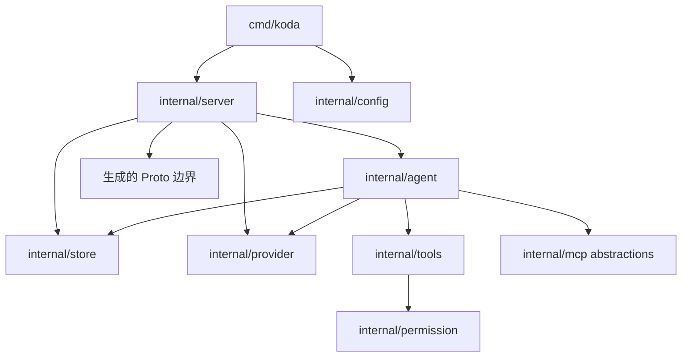

# 系统结构

[English](system-structure.md) · [架构导航](../architecture_zh-CN.md)

Koda 将进程装配、传输层、Agent 构造、工具和持久化分开，使持久化状态不依赖 UI 或
Provider 特有的数据表示。

## 进程模型

`koda serve` 启动 Connect API。`koda studio` 启动相同 API，并在同一个 loopback
origin 挂载内嵌 Studio 资源。服务以单进程运行：内存 catalog、交互 broker、Agent
cache 和 MCP 连接不会与另一个 Koda 进程协调。

启动过程按照依赖顺序执行：

1. 加载可选的进程配置；
2. 初始化诊断日志；
3. 打开 Provider registry 和本地 model catalog；
4. 加载固定的 Agent Skill catalog；
5. 连接 MCP server 并发现固定的工具 catalog；
6. 打开 SQLite，执行 Koda 和 ADK migration，创建 ADK Session service；
7. 构造 Agent factory 和 Connect handler；
8. 绑定 loopback listener 并启动 HTTP server；
9. 可选地使用默认浏览器打开 Studio。

启动失败策略取决于能力性质。无效配置、无法连接的已配置 MCP server 或不可用数据库
会阻止启动，因为继续运行会静默改变预期行为。无效的单个 skill 会被记录并跳过，因为
skill 是可选的附加能力。Provider 凭据缺失不会阻止启动，而是在 Session 尝试使用该
Provider 时报告。

关闭时先停止 Run admission 并取消 active Run，再依次停止 HTTP server、Session store
和 MCP 连接。Stdio MCP 子进程属于进程级 MCP manager。

## 生命周期范围

| 范围 | 拥有的状态 |
|---|---|
| 进程 | config、logging、Provider registry、model catalog、skill catalog、MCP connection、Run manager、interaction broker、HTTP server |
| Session | Provider 与 Model 选择、reasoning effort、workdir、权限、历史、context usage、compaction state |
| Run | identity、admission state、mode、用户输入、指令快照、带 sequence 的 frame journal、pending interaction、取消状态、当前 compaction snapshot |

进程级 catalog 在启动时加载或连接，并在没有对应修改 API 时保持固定。Session 设置会
持久化，并可能使缓存 Agent 失效。Run 状态绝不能被缓存 Runner 捕获。

## 包职责

| Package | 职责 |
|---|---|
| `cmd/koda` | 依赖装配、命令行、信号、listener 选择和关闭；不包含 Agent 或存储策略。 |
| `proto/koda/v1`、`gen/koda/v1` | 公共契约源文件和生成的传输类型，不是 domain model。 |
| `internal/server` | Connect 校验、Proto/domain 转换、frame 串行化、Run 协调和 Connect 错误映射。 |
| `internal/agent` | ADK Runner 构造与缓存、Prompt、Provider Model、标题生成和 compaction 模型调用。 |
| `internal/tools` | Coding 工具、路径解析、输出限制、审批计划、提问、Hashline 编辑和 Shell 策略。 |
| `internal/permission` | 能力类型、scope、访问级别和纯审批判断。 |
| `internal/store` | Session metadata、ADK Session service、SQLite migration、历史修改、锁和 compaction generation。 |
| `internal/provider` | Provider 定义、凭据、connection revision、内置 Model metadata、catalog 和 discovery。 |
| `internal/mcp` | MCP transport、连接、启动 catalog、命名空间工具、结果限制和审批策略。 |
| `internal/skills` | 进程级 Agent Skill 的发现与加载。 |
| `internal/studio`、`studio` | 内嵌资源服务和 Web 客户端；不定义持久化运行语义。 |

## 依赖边界

Server 是组合边界。核心包不导入生成的 Proto binding。Domain value 只在进入或离开
RPC 时转换，避免 API 演进把传输层关注点带入工具、存储、Provider 或 Agent 构造。

Store 提供 ADK 的 `SessionService`，但不依赖 Agent factory。Agent factory 使用窄化的
Provider、Session、Skill、MCP 和 Tool interface。工具报告 domain approval 和 question，
server adapter 再将其转换为流式 API 交互。

## 公共契约

`proto/koda/v1/service.proto` 是唯一事实来源。Run stream 只包含：

- complete 或 partial `Event` frame；
- 阻塞的 `ToolApproval` 交互；
- 阻塞的 `QuestionPrompt` 交互；
- 用于移除 pending interaction 的 `RunInteractionResolved` 更新；
- 瞬态 `CompactionProgress` frame；
- admission `RunStarted` frame；
- 终止的 `RunCompleted` 或 `RunTerminated` frame。

`Run` 会 admit 并初始订阅一次执行；`GetActiveRun` 恢复当前 snapshot，`WatchRun` 按
sequence 恢复观察，`CancelRun` 是客户端停止执行的唯一操作。

修改可观察行为或命令时，必须同步更新两份根 README。生成的 Go 和 TypeScript binding
通过 Buf 重新生成，不能直接编辑。
