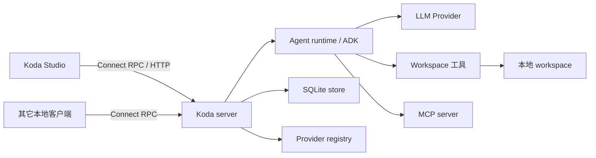

# 架构设计

[English](architecture.md)

本节介绍 Koda 当前已经实现的架构、保证 Agent turn 持久且安全的设计不变量，以及预期
扩展点。它面向运行时贡献者，不是 API 字段参考或运维手册。

进程设置和本地数据位置见[配置说明](configuration_zh-CN.md)。公共 API 的唯一事实来源
仍然是 [`proto/koda/v1/service.proto`](../proto/koda/v1/service.proto)。

## 系统概览

Koda 是本地单进程 coding-agent 服务。Connect RPC 边界拥有持久化 Session，并协调
基于 ADK 的 Agent 运行时、Provider、workspace 工具、MCP server 和 SQLite 历史。
内嵌 Studio 只是同一 API 的一个客户端，不拥有持久化对话状态。

设计遵循以下原则：

- Session 是配置、历史所有权和串行化边界；
- ADK Session history 是对话内容的事实来源；
- 生成的 Protobuf 类型停留在 server 边界；
- 可以缓存不可变的 Agent 结构，但 Run 特有状态必须通过 context 传递；
- partial output 和前端交互都是瞬态状态；
- complete event 与终态 Turn status 在失败或中断后仍会持久化；
- 只有历史和 Session metadata 一致后，成功 Run 才会以 complete 终态写入 journal；
- 文件和进程能力默认采用权限最小的有效策略；
- 启动时加载的进程能力与 Session、Run 配置相互独立。

## 专题

- [系统结构](architecture/system-structure_zh-CN.md)：进程启动、包职责、依赖方向和
  生命周期范围。
- [Run 生命周期](architecture/run-lifecycle_zh-CN.md)：从请求校验到流式输出、交互、
  持久化终结和 terminal publication 的完整 turn。
- [Agent 与工具](architecture/agents-and-tools_zh-CN.md)：Runner 缓存、分层指令、模式、
  路径分类、审批和提问。
- [存储与 Context Compaction](architecture/storage-and-compaction_zh-CN.md)：SQLite
  所有权、Session 锁、历史修改、撤销和持久化 compaction generation。
- [Provider 与集成](architecture/providers-and-integrations_zh-CN.md)：Provider revision、
  本地 model discovery、Agent Skills、MCP 和 Studio 边界。
- [安全与演进](architecture/security-and-evolution_zh-CN.md)：信任边界、日志约束、测试
  接缝和系统扩展规则。

## 术语

| 术语 | 含义 |
|---|---|
| Session | 持久化运行配置和历史所有权边界。 |
| Run | 一次 Server-owned execution，可以有一个或多个客户端订阅。 |
| Turn | Run 执行期间创建的持久化历史单元，可以是 completed、failed 或 interrupted 状态。 |
| Event | ADK 历史记录；complete event 持久化，partial event 只在瞬时存在。 |
| Frame | 客户端观察到的一条 `RunResponse` payload。 |
| Compaction generation | 针对已归档历史前缀生成的不可变 summary 和 working-state snapshot。 |
| Connection revision | 用于拒绝过期 discovery 和缓存 Agent 的 Provider 连接标识。 |

## 如何阅读这些文档

除非明确标为“可能的演进方向”，文档内容都描述当前行为。架构不变量是新实现必须保持
的约束；可能的演进方向不是已经实现的功能或开发承诺。
